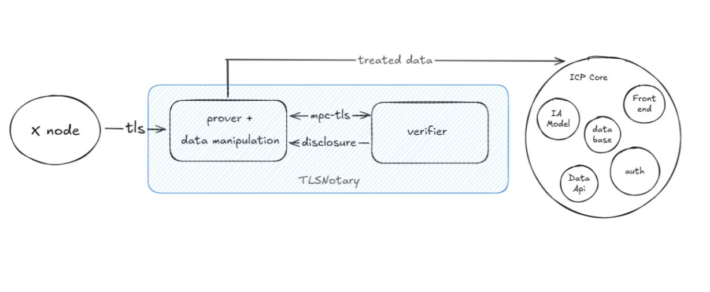

# ** repository currently inactive **
# PANORAMA BLOCK - https://panoramablock.com/

    

[Visit PanoramaBlock's official documentation](https://docs.panoramablock.com/)

**PanoramaBlock** is a decentralized on-chain data analytics platform designed to provide advanced, real-time insights across various blockchains. Built on the **Internet Computer Protocol (ICP)**, PanoramaBlock integrates data from different blockchains and processes it using **artificial intelligence (AI)** and **machine learning (ML)**. This allows traders and financial institutions to make informed decisions based on reliable and up-to-date data.

---

## The Problem 📊

In the cryptocurrency market, the lack of reliable and real-time data is a critical challenge. Many data aggregation platforms provide outdated or inaccurate information, leading to poorly informed investment decisions and increasing financial risk. Furthermore, the lack of **cross-chain integration** makes it difficult for traders and institutions to have a comprehensive view of the market, forcing them to rely on multiple data sources, which are not always secure or consistent.

These problems result in **inaccurate investment decisions**, **missed market opportunities**, and an overall increase in risk. The current landscape lacks a centralized, trustworthy solution for on-chain data analysis and visualization.

---

## Our Solution 💡

**PanoramaBlock** was created to address this problem. Our platform collects data directly from blockchains in real-time, ensuring that it is authentic, accurate, and relevant. Using **TLSNotary**, our solution ensures that the data received is genuine without compromising privacy or security.

Once collected, the data is transmitted to the **ICP Core**, where it is processed and analyzed using advanced AI and ML models. These models produce valuable insights, such as:

- **Anomaly detection** in large transactions.
- **Whale movement** monitoring (large investors).
- **Market predictions** based on historical patterns.

These insights are displayed in an **interactive on-chain dashboard**, allowing users to view critical information clearly and accessibly, aiding in strategic decision-making. Additionally, PanoramaBlock's decentralized architecture ensures data security and reliability at every step of the process.

### Key Benefits:
- **Real-time on-chain data**: We provide up-to-date data directly from blockchains, eliminating the need for third-party APIs.
- **Predictive AI analytics**: Our AI models identify patterns and generate actionable insights for traders and financial institutions.
- **Cross-chain compatibility**: We integrate data from multiple blockchains, providing a comprehensive view of the cryptocurrency market.
- **High security and privacy**: We use TLSNotary to ensure that data is secure and authentic without compromising user privacy.

---

## How It Works

1. **Wallet Authentication**: Users connect to PanoramaBlock using their cryptocurrency wallets, such as MetaMask or Ledger, ensuring secure login and privacy. This allows only authenticated users to access the data and insights provided by the platform.
   
2. **On-Chain Data Requests**: The system uses decentralized **blockchain nodes**, such as **Bitcoin** and **Ethereum**, integrated with **TLSNotary** to collect data directly from blockchain networks in real-time. TLSNotary introduces an external verifier, ensuring that the data is authentic and unaltered without compromising user privacy.

3. **Data Processing and AI & ML Analysis**: The collected data is transmitted to the backend, where it is processed using optimized data pipelines. **Artificial intelligence** and **machine learning** models analyze the raw data, detecting patterns and generating useful insights for users. Among the types of analysis are:
   - **Large volume transactions** (whale movements).
   - **Market predictions**.
   - **Anomaly detection** in transactions and wallets.

4. **Data Display on On-Chain Dashboard**: The processed data is displayed on an **interactive dashboard**, where users can view detailed metrics across various blockchains. The dashboards include asset movement graphs, transaction volume, and predictive analyses, helping traders and institutions make informed decisions based on precise and real-time data.

5. **Community and Integration**: PanoramaBlock offers a robust API for developers to integrate and create customized solutions. Additionally, the data and insights can be shared on **OpenChat**, fostering collaboration and discussion among users and building an active on-chain data analytics community.

---

## Application Architecture

    

### Nodes & TLSNotary

- We use a robust multi-cloud infrastructure to run our own **blockchain nodes** across various networks. This ensures that the data is collected directly from the networks, eliminating the need for intermediaries. Integration with **TLSNotary** adds a layer of security by introducing an external verifier in the data collection process. This guarantees that the data received is authentic and unaltered without compromising user privacy.

### TLSNotary Integration - Technical Details

#### **Introduction**
The integration of **TLSNotary** ensures the integrity and authenticity of data collected from blockchain nodes, verifying that the data has been collected from a trusted node and subsequently committed to the blockchain.

#### **Components:**

- **Blockchain Node (X Node):**
  - The blockchain node from which data is collected. Data from this node is transmitted securely using TLS (Transport Layer Security) to ensure encryption and protection from tampering during transmission.
  
- **TLSNotary:**
  - **Prover & Data Manipulation:**
    - The prover is responsible for collecting data from the X Node over a secure TLS connection. The data is then processed as required by the application.
    - **MPC-TLS:** Multi-Party Computation TLS ensures that multiple parties can jointly validate the TLS session without revealing private keys, enhancing security.
    - **Disclosure:** The results are then disclosed to the verifier, ensuring the data's integrity and origin.
  
  - **Verifier:**
    - The verifier ensures the authenticity of the manipulated data received from the prover, using MPC-TLS and disclosure techniques before forwarding it to the ICP Core.
  
- **ICP Core:**
  - The ICP Core manages the overall application logic, which includes several microservices, such as:
    - **Data API:** Interface for accessing the verified data.
    - **Database:** Storage for processed and verified data.
    - **Auth Service:** Authentication within the platform using Internet Identity.
    - **AI Model:** AI and ML models for data analysis.
    - **Frontend:** User interface for interaction with the system.

#### **Data Flow**

1. **Data Collection:** Data is collected from the blockchain node using a secure TLS connection.
2. **Data Processing:** The prover processes the collected data within TLSNotary.
3. **Data Verification:** The verifier ensures data authenticity using MPC-TLS before forwarding it to the ICP Core.
4. **Data Storage:** Verified data is stored in the ICP Core's database and made accessible through the Data API.

#### **Security Considerations**
- **Data Integrity:** Ensures data from nodes is untampered.
- **Authenticity:** Confirms that data originates from the correct node.
- **Confidentiality:** Secure transmission using TLS prevents unauthorized access.

### ICP Core

- The **ICP Core** is the heart of PanoramaBlock. It consists of a **multi-canister architecture** responsible for receiving, processing, and storing the collected node data. This data is indexed into stable structures and SQLite databases, feeding into our **AI models**. The ICP Core also enables anomaly detection in wallets and transactions, providing insights based on network protocols.

### AI & ML Models

- The **artificial intelligence** and **machine learning** models used by PanoramaBlock analyze large volumes of on-chain data, detecting patterns and anomalies. These models can:
  - **Predict market trends** based on historical patterns.
  - **Detect abnormal behavior** in transactions and large volume movements.
  - **Generate alerts** for users about significant changes in the crypto market.

These insights improve trading efficiency and provide risk and opportunity recommendations for financial institutions and individual traders.

---

## Roadmap 🗺️

PanoramaBlock has an ambitious vision to become the leading on-chain data platform in the market. Below is our detailed roadmap, outlining the next steps in our development:

### Short Term Goals 

- **Node Expansion**: Integration of new blockchains (Solana, Avalanche, HBAR) to expand on-chain data coverage, allowing more traders and institutions to benefit from our platform.
- **User Feedback**: Collect and implement feedback from traders and developers to improve the user experience, both in the dashboard and in integration APIs.

### Mid Term Goals

- **Enhanced AI and ML Algorithms**: Develop new AI models that offer more accurate predictions and deeper risk analysis. This includes improved whale movement detection and the identification of arbitrage opportunities.
- **Integration Tools**: Add new tools that allow for more robust data analysis, including integration with Web2 and Web3 data sources to create a more comprehensive on-chain data platform.

### Long Term Goals 

- **Global Expansion**: Expand the platform to new markets, adapting to local regulations and collaborating with global financial institutions.
- **On-Chain Data Hub**: Become the leading on-chain data hub, where developers, traders, and financial institutions can access, integrate, and collaborate with trusted on-chain data powered by our AI and ML.
"""

