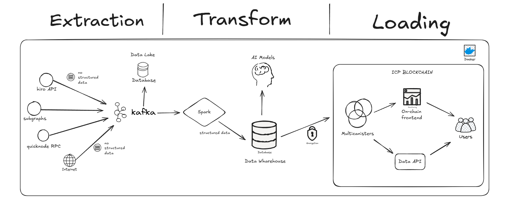

## Technical Documentation for Panorama Block

### 1. TLSNotary Integration

#### **Introduction**
This section of document outlines the integration of TLSNotary within the Panorama Block platform. The primary goal is to ensure the integrity and authenticity of data collected from blockchain nodes, verifying that the data has indeed been collected from a trusted node and subsequently committed to the blockchain.

#### **System Architecture Overview**
This section provides a detailed explanation of the overall system architecture, emphasizing the role of TLSNotary in ensuring data integrity.

**Diagram Overview:**
The following diagram represents the architecture used in the Panorama Block system, demonstrating how TLSNotary is integrated with the data collection and verification process.

**Components:**

- **X Node:**
  - This is the blockchain node from which data is collected. Data from this node is transmitted securely using TLS (Transport Layer Security) to ensure encryption and protection from tampering during transmission.
  
- **TLSNotary:**
  - **Prover + Data Manipulation:**
    - The prover is responsible for collecting data from the X Node over a secure TLS connection. The data is then processed and manipulated as required by the application.
    - **MPC-TLS:** 
      - The Multi-Party Computation TLS (MPC-TLS) ensures that multiple parties can jointly validate the TLS session without revealing their private keys, enhancing the security and integrity of the verification process.
    - **Disclosure:** 
      - The results of the data manipulation are then disclosed to the verifier in a manner that ensures the integrity and origin of the data.
  
  - **Verifier:**
    - The verifier receives the manipulated data from the prover. Using the disclosure and MPC-TLS, the verifier ensures that the data has not been tampered with and confirms its authenticity before forwarding it to the ICP Core.
  
- **ICP Core:**
  - The ICP Core is responsible for managing the overall application logic, which includes several microservices such as:
    - **Data API:** Interface for accessing and aggregating the verified data.
    - **Database:** Storage for all processed and verified data.
    - **Auth Service:** Handles authentication within the platform, built using the Internet Indentity.
    - **IA Model:** Implements any artificial intelligence or machine learning models for data analysis.
    - **Frontend:** User interface layer allowing interaction with the system.
  
#### **Data Flow**

The following steps describe the data flow within the system:

1. **Data Collection:**
   - Data is collected from the X Node using a secure TLS connection.
   
2. **Data Processing:**
   - The collected data is processed and manipulated by the Prover component within TLSNotary.
   
3. **Data Verification:**
   - The processed data is passed to the Verifier component, where it is verified using MPC-TLS to ensure its authenticity and integrity.
   
4. **Data Storage and Access:**
   - Once verified, the data is forwarded to the ICP Core, where it is stored in the database and made accessible through the Data API. 

#### **Security Considerations**
The integration of TLSNotary provides a high level of security by ensuring:

- **Data Integrity:** Data collected from the node is guaranteed to be untampered.
- **Authenticity:** Verifies that the data originates from the specified node.
- **Confidentiality:** Secure transmission using TLS prevents unauthorized access during data transmission.

#### **Conclusion**
The integration of TLSNotary within the Panorama Block project significantly enhances the security and trustworthiness of the data collected and stored within the system. This approach not only secures data in transit but also ensures that the data processed and stored on the blockchain is reliable and verifiable.

